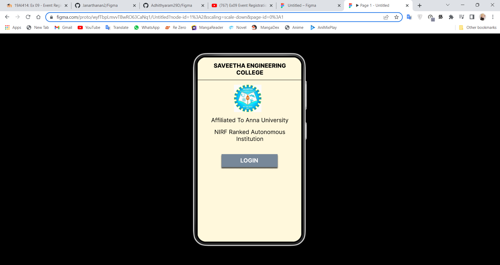
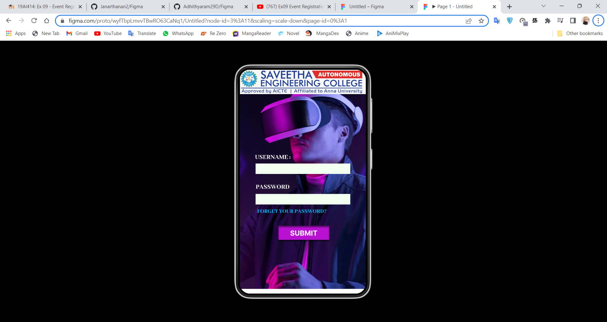
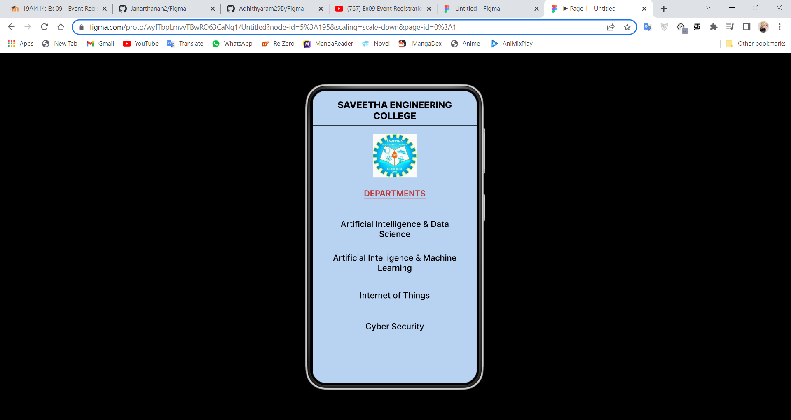

# Event Registration Web Application

## AIM:
To design, develop and deploy a web application for event registration.

## DESIGN STEPS:

### Step 1:
Create a new frame.

### Step 2:
Select any one preset size of your choice.

### Step 3:
Select the shapes you need.

### Step 4:
Import images as needed.

### Step 5:
Create pages based on your need and link them.

### Step 6:

Validate the HTML and CSS code.

### Step 6:

Publish the website in the given URL.

## DESIGN TOOL:
Figma

## CODE:
```

/* SAVEETHA ENGINEERING COLLEGE */

position: absolute;
width: 334px;
height: 57px;
left: 14px;
top: 17px;
font-family: 'Inter';
font-style: normal;
font-weight: 770;
font-size: 20px;
line-height: 24px;
text-align: center;
color: #000000;
font-variation-settings: 'slnt' 0;

/* Affiliated To Anna University */

position: absolute;
width: 334px;
height: 30px;
left: 14px;
top: 206px;
font-family: 'Inter';
font-style: normal;
font-weight: 400;
font-size: 20px;
line-height: 24px;
text-align: center;
color: #000000;

/* NIRF Ranked Autonomous Institution */

position: absolute;
width: 334px;
height: 50px;
left: 14px;
top: 247px;
font-family: 'Inter';
font-style: normal;
font-weight: 400;
font-size: 20px;
line-height: 24px;
text-align: center;
color: #000000;

/* Line 1 */

position: absolute;
width: 360px;
height: 0px;
left: 0px;
top: 79px;
border: 1px solid #000000;

/* logo 1 */

position: absolute;
width: 95.5px;
height: 95.08px;
left: 126px;
top: 95px;
background: url(logo.jpg);

/* Rectangle 1 */

position: absolute;
width: 194px;
height: 45px;
left: 83px;
top: 336px;
background: #778899;
box-shadow: 0px 4px 4px rgba(0, 0, 0, 0.25), 0px 4px 4px rgba(0, 0, 0, 0.25), 0px 4px 4px rgba(0, 0, 0, 0.25), 0px 4px 4px rgba(0, 0, 0, 0.25);

/* LOGIN */

position: absolute;
width: 152px;
height: 27px;
left: 103px;
top: 346px;
font-family: 'Inter';
font-style: normal;
font-weight: 700;
font-size: 20px;
line-height: 24px;
text-align: center;
color: #FFFFFF;

/* Login Page */

position: relative;
width: 360px;
height: 640px;
background: #FFFFFF;

/* SAVEETHA ENGINEERING COLLEGE */

position: absolute;
width: 334px;
height: 57px;
left: 13px;
top: 19px;
font-family: 'Inter';
font-style: normal;
font-weight: 770;
font-size: 20px;
line-height: 24px;
text-align: center;
color: #000000;
font-variation-settings: 'slnt' 0;

/* Line 2 */

position: absolute;
width: 360px;
height: 0px;
left: 0px;
top: 76px;
border: 1px solid #000000;

/* logo 2 */

position: absolute;
width: 95.5px;
height: 95.08px;
left: 132px;
top: 95px;
background: url(logo.jpg);

/* DEPARTMENTS */

position: absolute;
width: 152px;
height: 22px;
left: 104px;
top: 213px;
font-family: 'Inter';
font-style: normal;
font-weight: 600;
font-size: 18px;
line-height: 22px;

/* identical to box height */
text-align: center;
text-decoration-line: underline;
color: #BF3B3B;


/* Artificial Intelligence & Data Science */

position: absolute;
width: 278px;
height: 48px;
left: 41px;
top: 280px;
font-family: 'Inter';
font-style: normal;
font-weight: 500;
font-size: 18px;
line-height: 22px;
text-align: center;
color: #000000;

/* Artificial Intelligence & Machine Learning */

position: absolute;
width: 278px;
height: 48px;
left: 41px;
top: 354px;
font-family: 'Inter';
font-style: normal;
font-weight: 500;
font-size: 18px;
line-height: 22px;
text-align: center;
color: #000000;

/* Internet of Things */

position: absolute;
width: 278px;
height: 48px;
left: 41px;
top: 436px;
font-family: 'Inter';
font-style: normal;
font-weight: 500;
font-size: 18px;
line-height: 22px;
text-align: center;
color: #000000;

/* Cyber Security */

position: absolute;
width: 278px;
height: 48px;
left: 41px;
top: 504px;
font-family: 'Inter';
font-style: normal;
font-weight: 500;
font-size: 18px;
line-height: 22px;
text-align: center;
color: #000000;

```

## OUTPUT:




## RESULT:
The program to design, develop and deploy a web application for event registration is completed successfully.